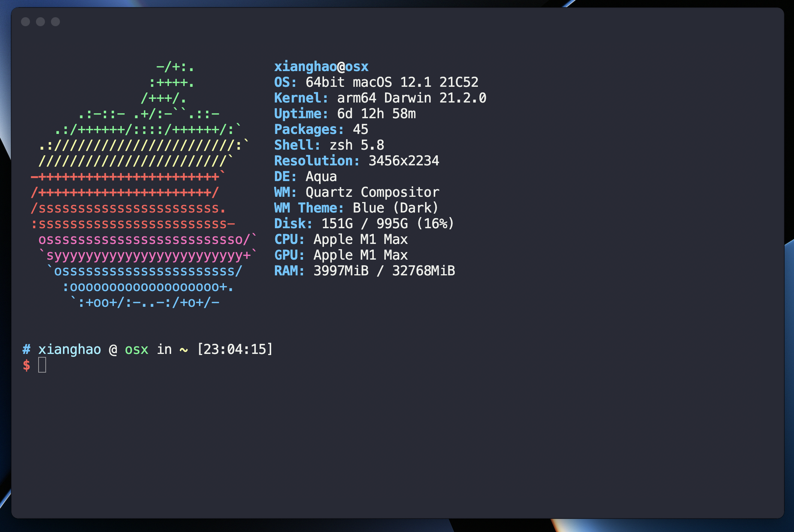

# 好看的Terminal

## 浏览

* [展示](#presentation)
* [环境](#environment)
* [准备](#preperation)
* [配置oh-my-zsh](#oh-my-zsh)
  * [语法高亮和自动补全](#oh-my-zsh-01)
  * [主题](#oh-my-zsh-02)
* [美化hyper](#hyper)
* [screenfetch](#sf)

## 展示<span id='presentation'></span>



## 环境<span id='environment'></span>

* Macbook Pro M1 Max 2021
* Macbook Pro 16-inch 2019
* shell解释器 为**zsh**

## 准备<span id='preperation'></span>

* 安装**Hyper** [here](https://hyper.is)
* 安装**oh-my-zsh** [here](https://ohmyz.sh/#install)

## 配置oh-my-zsh<span id='oh-my-zsh'></span>

### 语法高亮和自动补全<span id='oh-my-zsh-01'></span>

下载**zsh-syntax-highlighting**和**zsh-completions**插件

```bash
# 将语法高亮插件下载到插件文件见
cd ~/.oh-my-zsh/custom/plugins
git clone https://github.com/zsh-users/zsh-syntax-highlighting.git
git clone https://github.com/zsh-users/zsh-completions.git
```

打开`.zshrc`, 配置插件

```bash
vi ~/.zshrc
```

看到如下`plugins`, 像里面添加`zsh-syntax-highlighting`和`zsh-completions`

```bash
plugins={
    git
    zsh-syntax-highlighting
    zsh-completions    
}
```

重新加载`.zshrc`

```
source ~/.zshrc
```

### 主题<span id='oh-my-zsh-02'></span>

```bash
vi ~/.zshrc

# 修改ZSH_THEME后的面的主题为ys
ZSH_THEME="ys"

# 修改后关闭.zshrc并重新加载
source ~/.zshrc
```

## 美化Hyper<span id='hyper'></span>

```bash
# 打开hyper配置文件
vi ~/.hyper.js

# 向plugins添加hyper-snazzy
plugins: [
    "hyper-snazzy"
]

# 保存后，重启Hyper即可修改成功
```

## screenfetch - 在终端中显示系统图标及参数<span id='sf'></span>

* 安装**screenfetch**

```sh
# 使用homebrew安装
brew install screenfetch
```

* 打开终端时自动启动screenfetch

```sh
# 打开.zshrc
vi ~/.zshrc

# 在里面加入
screenfetch
```

